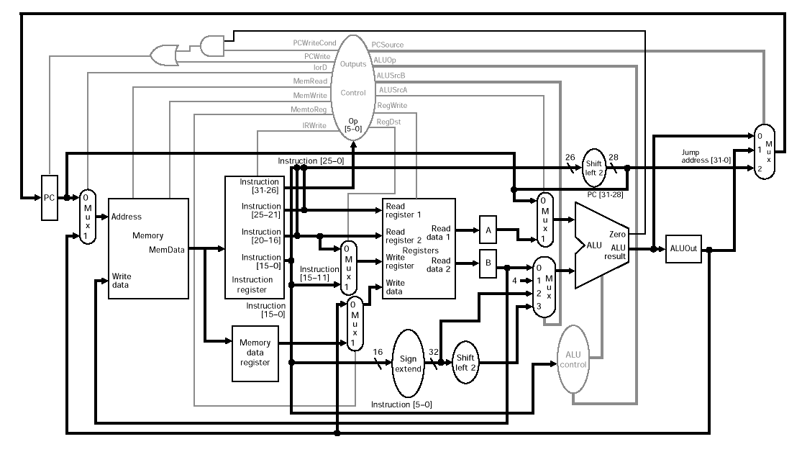

# mips
A MIPS processor simulator written in rust.

## MIPS processor diagram ##

(Source: [Ruye Wang](http://fourier.eng.hmc.edu/e85_old/lectures/processor/node6.html))

## Design references ##

[RISC Architecture - MIPS (Stanford)](https://cs.stanford.edu/people/eroberts/courses/soco/projects/risc/mips/index.html)

[MIPS Processor (Multiple Cycle)](http://fourier.eng.hmc.edu/e85_old/lectures/processor/node6.html)

[MIPS Architecture (Wikipedia)](https://en.wikipedia.org/wiki/MIPS_architecture)